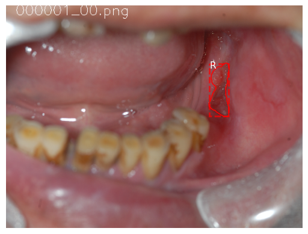
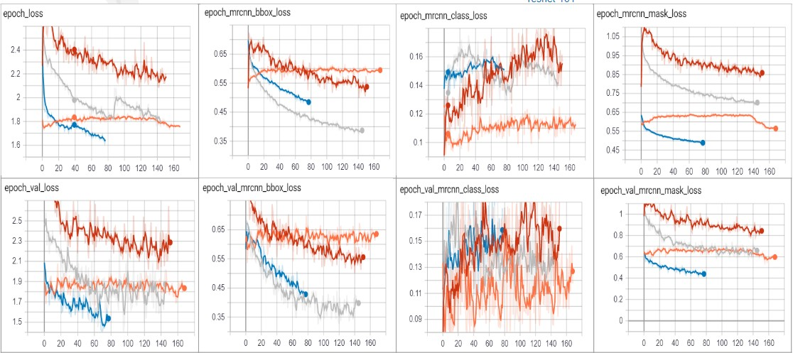
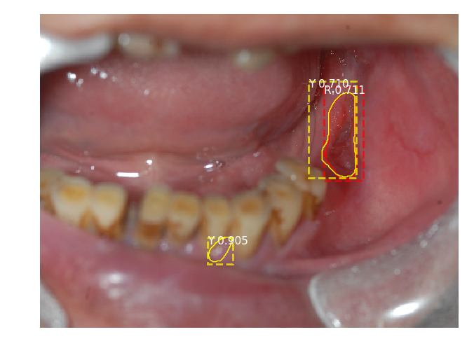
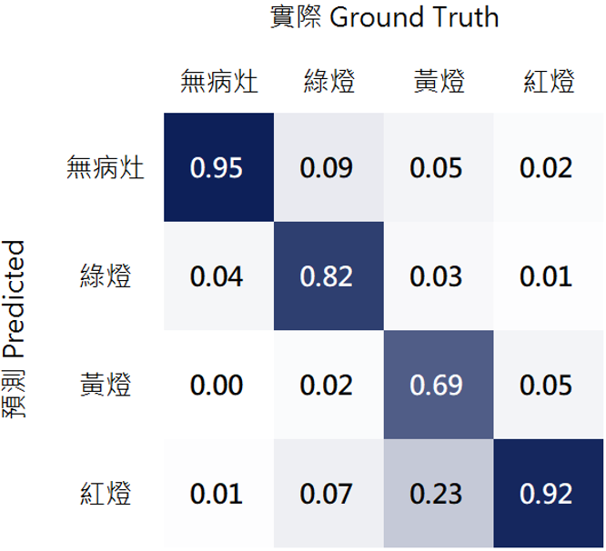
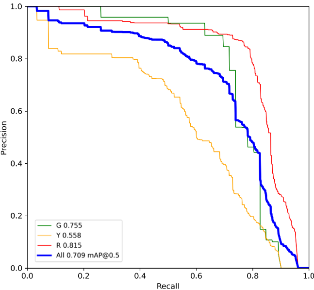
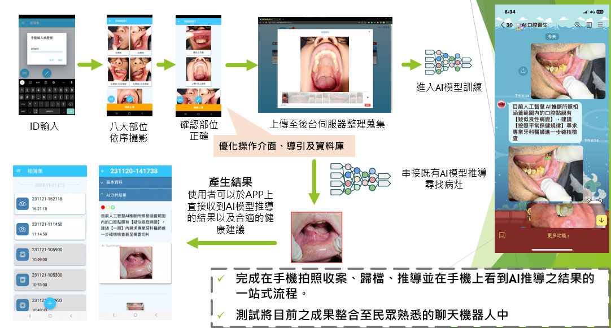

# Multi-Agent System — DINOv2 (Swin-Transformer–based visual analyzer) + Mask R-CNN (image analyzer) + RAG-based LLM (data retriever) with PyTorch

This project combines a visual analyzer, instance segmentation, and retrieval-augmented generation (RAG) to build a practical multi-agent pipeline for medical imaging and knowledge grounding.

---

## Table of Contents
- [Features](#features)
- [Use Without Installation](#use-without-installation)
- [Data Preparation](#data-preparation)
- [Step-by-Step Inspection (Notebooks)](#step-by-step-inspection-notebooks)
- [LLM + RAG Integration](#llm--rag-integration)
- [Quick Start](#quick-start)
- [Model Deployment](#model-deployment)
- [Image / Static Asset Versioning](#image--static-asset-versioning)
- [Push to Registries](#push-to-registries)
- [K8s Manifests](#k8s-manifests)
- [GitHub Actions (CI/CD)](#github-actions-cicd)
- [Nginx Config](#nginx-config)
- [Run with Docker & .env](#run-with-docker--env)
- [Citation](#citation)
- [App Screenshot](#app-screenshot)
- [References](#references)
- [Projects Using This Model](#projects-using-this-model)

---

## Features
- Mask R-CNN (FPN + ResNet-101) implementation under `mrcnn/`
- ParallelModel for multi-GPU training
- MS COCO AP evaluation utilities
- Step-by-step inspection notebooks (data/model/weights)
- Minimal RAG + LLM API (FastAPI/Flask), with mock LLM or external TGI/vLLM via env
- Dockerfiles and GitHub Actions CI/CD examples

---

## Use Without Installation
If you only need to run predictions, see **Quick Start** below. For training/evaluation, follow **Data Preparation** and **Notebooks** sections.

---

## Data Preparation
Datasets are split into **train/val/test**. Use `annotation_platform.py` for annotations.

```
annotations/
dataset/
 ├─ all/
 │  ├─ annotations_mask/
 │  ├─ annotations_pt/
 │  └─ images/
 ├─ test/
 │  ├─ annotations/
 │  └─ images/
 ├─ train/
 │  ├─ annotations/
 │  └─ images/
 └─ val/
    ├─ annotations/
    └─ images/
annotation_platform.py   # annotation tool
```

**Repository includes**
- Mask R-CNN (FPN + ResNet-101) under `mrcnn/`
- ParallelModel for multi-GPU training
- COCO-style AP evaluation
- Example training on custom datasets

> If you use this code in research, please consider citing (BibTeX below).

---

## Step-by-Step Inspection (Notebooks)
Three Jupyter notebooks provide visual, incremental inspection:

- `inspect_data.ipynb` — data, anchors, RPN steps  
- `inspect_model.ipynb` — proposals, box refinement, masks  
- `inspect_weights.ipynb` — weight histograms, health checks  

### 1) Anchor Sorting & Filtering
Visualizes RPN steps, positive/negative anchors, and anchor box refinement.

### 2) Bounding-Box Refinement
Shows final detection boxes (dotted) and refinements (solid).

### 3) Mask Generation
Generated masks (scaled and placed correctly):




### 4) Layer Activations
Check for pathologies (all-zero, noise).

### 5) Weight Histograms
Included in `inspect_weights.ipynb`.

### 6) TensorBoard Logging
Loss curves & checkpoints per epoch.  


### 7) Putting It All Together


### 8) Metrics: Confusion Matrix / PR Curve



---

## LLM + RAG Integration
**Minimal RAG + LLM API (FastAPI/Flask):**
- Lightweight retrieval with TF-IDF (scikit-learn)
- Mock LLM by default; optionally call TGI/vLLM via environment variables
- Dockerfile included
- GitHub Actions CI/CD workflow included

---

## Quick Start

### [1] Create virtualenv & Install
```bash
python -m venv .venv
# Windows
.venv\Scripts\activate
# macOS/Linux
# source .venv/bin/activate

pip install -r requirements.txt
```

### [2] Run app
```bash
python app_entry.py
```

### Example request
```bash
curl -X POST "http://localhost:8000/rag/answer" \
  -H "Content-Type: application/json" \
  -d '{"question": "What is oral leukoplakia screening suggestion?"}'
```

---

## Model Deployment

### [1] 模型版本管理（上傳至 GCS）
1) 建立 bucket 並上傳模型：
```bash
gcloud storage buckets create gs://model-bucket-20250820 --location=asia-east1
gcloud storage cp dinov2_token_segmentation_final.pth \
  gs://model-bucket-20250820/models/
```

2) 查看檔案：
```bash
gcloud storage ls gs://model-bucket-20250820/models/
```

### [2] 建立 Docker 映像
> 你可以用 **Option A: Google Cloud Build** 或 **Option B: 本地 Docker**。

**Option A — Cloud Build → GCR**
```bash
gcloud config set project YOUR_PROJECT_ID
gcloud builds submit --tag gcr.io/YOUR_PROJECT_ID/flask-app:latest
```

**Option B — Local Docker → GCR**
```bash
# Build
docker build -t gcr.io/YOUR_PROJECT_ID/flask-app:latest .

# (可選) 登入並推送
gcloud auth configure-docker
docker push gcr.io/YOUR_PROJECT_ID/flask-app:latest
```

> 說明：`gcr.io/<PROJECT_ID>/<IMAGE_NAME>:<TAG>`

### [3] 本地測試
請確保容器內服務監聽 `8000`（與 Quick Start 一致）：
```bash
docker run -p 8000:8000 gcr.io/YOUR_PROJECT_ID/flask-app:latest

curl -X POST "http://localhost:8000/rag/answer" \
  -H "Content-Type: application/json" \
  -d '{"question":"What is leukoplakia?"}'
```

### [4] 部署到 Cloud Run
```bash
gcloud run deploy flask-dino-service \
  --image gcr.io/YOUR_PROJECT_ID/flask-app:latest \
  --platform managed \
  --region asia-east1 \
  --allow-unauthenticated \
  --set-env-vars MODEL_BUCKET=model-bucket-20250820,MODEL_BLOB=models/dinov2_token_segmentation_final.pth
```

(若使用本地建置) 推送並確認：
```bash
docker push gcr.io/YOUR_PROJECT_ID/flask-app:latest
gcloud container images list-tags gcr.io/YOUR_PROJECT_ID/flask-app
```

---

## Image / Static Asset Versioning

### Method 1 — `docker run` with volume
```bash
docker run -d \
  -p 5000:5000 \
  -v C:\Users\Evan\Desktop\master\Side_project\OralCancerAPP_main\static\images:/app/static/images \
  --name flask-oral-images \
  oralcancer_ai_template
```

### Method 2 — `docker compose`
```bash
docker compose up --build
# or specify file
docker compose -f infra/docker-compose.yml up --build
```

---

## Push to Registries

> Method 1: DockerHub
```bash
docker login -u <USERNAME>
docker tag rag-ai-api:latest <USERNAME>/rag-ai-api:latest
docker push <USERNAME>/rag-ai-api:latest
```

> Method 2: GCP Artifact Registry
>> 建立 Artifact Registry (Docker repository)
```bash
gcloud artifacts repositories create flask-app-repo \
    --repository-format=docker \
    --location=asia-east1 \
    --description="Docker repo for flask app"
```

>> 確認建立成功
```bash
gcloud artifacts repositories list --location=asia-east1
```
>  其路徑格式如下：  
> `asia-east1-docker.pkg.dev/<PROJECT_ID>/<REPO>/<IMAGE>:<TAG>`

```bash
# 設定 Artifact Registry 認證 (這樣 docker build/push 才會生效)
gcloud auth configure-docker asia-east1-docker.pkg.dev

# 重新標記
docker tag rag-ai-api:latest \
  asia-east1-docker.pkg.dev/<PROJECT_ID>/<REPO>/rag-ai-api:latest

# 推送
docker push \
  asia-east1-docker.pkg.dev/<PROJECT_ID>/<REPO>/rag-ai-api:latest
```

---

## Docker deployment
### Script preparation
> [1] `docker-compose.yaml` (for local dev)
```yaml
version: "3.9"
services:
  flask-oral-images:
    build: .
    ports:
      - "5000:5000"
    volumes:
      - ./uploads/images:/app/static/images

  nginx:
    image: nginx:alpine
    ports:
      - "80:80"
    volumes:
      - ./uploads/images:/usr/share/nginx/html/images
      - ./nginx.conf:/etc/nginx/conf.d/default.conf
```

> [2] `deployment.yaml` (Kubernetes)
>> Deployment version
```yaml
apiVersion: apps/v1
kind: Deployment
metadata:
  name: rag-ai-api
  namespace: staging
spec:
  replicas: 3
  selector:
    matchLabels:
      app: rag-ai-api
  template:
    metadata:
      labels:
        app: rag-ai-api
    spec:
      containers:
      - name: rag-ai-api
        image: <USERNAME>/rag-ai-api:latest
        ports:
        - containerPort: 8000
        env:
        - name: USE_TGI
          value: "0"
```
>> Service
```yaml
apiVersion: v1
kind: Service
metadata:
  name: rag-ai-service
  namespace: staging
spec:
  selector:
    app: rag-ai-api
  ports:
    - protocol: TCP
      port: 80
      targetPort: 8000
  type: LoadBalancer
```

### 部署到 **staging**
```bash
kubectl create namespace staging
kubectl apply -f deployment.yaml
kubectl get pods -n staging
kubectl get svc  -n staging
```
### 滾動更新 / 回滾
```bash
# Rolling update
kubectl set image deployment/rag-ai-api rag-ai-api=<USERNAME>/rag-ai-api:v2 -n staging
kubectl rollout status deployment/rag-ai-api -n staging

# Rollback
kubectl rollout undo deployment/rag-ai-api -n staging
```

### 部署到 **production**（staging 驗證後）
```bash
kubectl create namespace production
kubectl apply -f deployment.yaml --namespace=production
```

## Moninoring / Alerting
> 1) 設定資料來源
>> 測試連線確認能取到 metrics

> 2) 建立告警規則
>> 進 Dashboard → 選一個 Panel → 點「Alert」，i.e., avg(rate(http_requests_total{status="500"}[5m])) > 0.1

> 3) 設定通知管道 (Contact points)
>> 支援：Email、Slack、Microsoft Teams、LINE Webhook、PagerDuty

> 4) 測試與調優
>> 模擬高 CPU / 錯誤率，確認告警能即時送出
>> 避免「alert flood」：要加 閾值 + 持續時間

> 5) 整體指標
>> 模型輸入/輸出分布：偵測 Data Drift
>> 推論延遲 (inference latency)
>> 模型錯誤率 (ex: misclassification %)
>> GPU 資源使用率
---

## GitHub Actions (CI/CD)
> 1) 先找到引數的部分
```bash
project_id: ${{ secrets.GCP_PROJECT_ID }}
service_account_key: ${{ secrets.GCP_SA_KEY }}
```
> 2) 進入GitHub repo → Settings → Secrets and variables → Actions → New repository secret (建立以下secret keys)
GCP_PROJECT_ID → 你的 GCP 專案 ID，例如： oral-flask-ai-app-20250820
GCP_SA_KEY → 你的 GCP service account JSON 金鑰內容（整份貼進去）。
> 建立json方式: 
> [1] 在左側選單 → 找到 IAM & Admin → Service Accounts
> [2] 點 + Create Service Account
> Name: github-actions-deployer（名字可自訂）
> ID 會自動生成，記住這個（格式會像 github-actions-deployer@your-project-id.iam.gserviceaccount.com, i.e., github-actions-deployer@oral-cancer-ai.iam.gserviceaccount.com）

> [2-1] CI/CD script (在 github上可以放到這個路徑下: .github/workflows/deploy.yml)
```yaml
name: CI/CD

on:
  push:
    branches: [ "main" ]

jobs:
  build-and-deploy:
    runs-on: ubuntu-latest
    steps:
      - name: Checkout
        uses: actions/checkout@v4

      - name: Set up Docker Buildx
        uses: docker/setup-buildx-action@v3

      - name: Docker login
        run: echo "${{ secrets.DOCKER_PASS }}" | docker login -u ${{ secrets.DOCKER_USER }} --password-stdin

      - name: Build image
        run: docker build -t ${{ secrets.DOCKER_USER }}/rag-ai-api:${{ github.sha }} .

      - name: Push image
        run: docker push ${{ secrets.DOCKER_USER }}/rag-ai-api:${{ github.sha }}

      - name: Deploy to K8s (Staging)
        uses: azure/k8s-deploy@v4
        with:
          manifests: |
            ./k8s/deployment.yaml
          images: |
            ${{ secrets.DOCKER_USER }}/rag-ai-api:${{ github.sha }}
          namespace: staging
```
> [2-2] 用指令建立 Service Account
```bash
gcloud iam service-accounts create github-actions-deployer \
 --display-name="GitHub Actions Deployer" \
 --project=oral-cancer-ai
```

> 輸出範例
```bash
Updated IAM policy for project [oral-cancer-ai].
bindings:
- members:
  - serviceAccount:service-865598980136@gcp-sa-aiplatform.iam.gserviceaccount.com
  role: roles/aiplatform.serviceAgent
- members:
  - serviceAccount:github-actions-deployer@oral-cancer-ai.iam.gserviceaccount.com
  role: roles/artifactregistry.writer
- members:
  - serviceAccount:service-865598980136@containerregistry.iam.gserviceaccount.com
  role: roles/containerregistry.ServiceAgent
- members:
  - serviceAccount:865598980136-compute@developer.gserviceaccount.com
  role: roles/editor
- members:
  - serviceAccount:github-actions-deployer@oral-cancer-ai.iam.gserviceaccount.com
  role: roles/iam.serviceAccountUser
- members:
  - user:evan1632885@gmail.com
  role: roles/owner
- members:
  - serviceAccount:service-865598980136@gcp-sa-pubsub.iam.gserviceaccount.com
  role: roles/pubsub.serviceAgent
- members:
  - serviceAccount:github-actions-deployer@oral-cancer-ai.iam.gserviceaccount.com
  role: roles/run.admin
- members:
  - serviceAccount:service-865598980136@serverless-robot-prod.iam.gserviceaccount.com
  role: roles/run.serviceAgent
etag: BwY9GCsi4f4=
version: 1
```

> 確認建立成功
```bash
gcloud iam service-accounts list --project oral-cancer-ai --format="table(displayName,email)"
```

> 3) 授權角色 (Role)

> 4) 產生 JSON Key

>   建立完成 Service Account 後，在列表點選它 → Keys 分頁

>   點 Add Key → Create new key

>   選 JSON → 它會下載一個 key.json 檔案到你的電腦

> 5) 放到 GitHub Secrets

>   到 GitHub repo → Settings → Secrets and variables → Actions → New repository secret

>     Name: GCP_SA_KEY

>     Value: 貼上剛剛的 JSON

> 6) 授權訪問權限

>   [6-1] 利用自己帳號
```bash
gcloud auth login
```

>   [6-2] 利用 Service Account - 用金鑰登入 GCP
```bash
gcloud auth activate-service-account \
 github-actions-deployer@oral-cancer-ai.iam.gserviceaccount.com \
 --key-file=key.json \
 --project=oral-cancer-ai
```

> 7) 設定 Artifact Registry 認證 (這樣 docker build/push 才會生效)
```bash
gcloud auth configure-docker asia-east1-docker.pkg.dev
```

> 8) Run with Docker & .env
```bash
docker run --env-file .env -p 5000:5000 oralcancer_ai_template
```

---
## 模型終端部署
> 1. 模型導出成 ONNX
```bash
python tools/deploy/convert-to-onnx.py \
  --config-file configs/coco/instance-segmentation/maskformer2_swin_tiny_bs16_50ep.yaml \
  --output ./mask2former_swin.onnx \
  --opts MODEL.WEIGHTS ./output/model_final.pth
```

> 2. TensorRT 優化 (Jetson Nano 上執行)
```bash
# 安裝 TensorRT (Nano 已內建)
sudo apt-get install python3-pip libnvinfer-dev libnvinfer-bin

# 將 ONNX 轉 TensorRT engine
/usr/src/tensorrt/bin/trtexec \
  --onnx=mask2former_swin.onnx \
  --saveEngine=mask2former_swin.engine \
  --fp16
```

> 3. 單圖推理
```python
import tensorrt as trt
import pycuda.driver as cuda
import pycuda.autoinit
import numpy as np
import cv2

# 載入 TensorRT engine
TRT_LOGGER = trt.Logger(trt.Logger.WARNING)
with open("mask2former_swin.engine", "rb") as f, trt.Runtime(TRT_LOGGER) as runtime:
    engine = runtime.deserialize_cuda_engine(f.read())

context = engine.create_execution_context()

# 分配緩衝區
inputs, outputs, bindings, stream = [], [], [], cuda.Stream()

for binding in engine:
    size = trt.volume(engine.get_binding_shape(binding)) * engine.max_batch_size
    dtype = trt.nptype(engine.get_binding_dtype(binding))
    host_mem = cuda.pagelocked_empty(size, dtype)
    dev_mem = cuda.mem_alloc(host_mem.nbytes)
    bindings.append(int(dev_mem))
    if engine.binding_is_input(binding):
        inputs.append({"host": host_mem, "device": dev_mem})
    else:
        outputs.append({"host": host_mem, "device": dev_mem})

def infer(image):
    # 預處理
    img = cv2.resize(image, (512, 512))
    img = img.astype(np.float32) / 255.0
    img = np.transpose(img, (2, 0, 1))[None, ...]

    np.copyto(inputs[0]["host"], img.ravel())

    # 複製到 GPU
    cuda.memcpy_htod_async(inputs[0]["device"], inputs[0]["host"], stream)
    context.execute_async_v2(bindings=bindings, stream_handle=stream.handle)
    cuda.memcpy_dtoh_async(outputs[0]["host"], outputs[0]["device"], stream)
    stream.synchronize()

    # 後處理
    output = outputs[0]["host"].reshape(1, 150, 512, 512)  # 假設150 classes
    mask = np.argmax(output[0], axis=0)
    return mask

# 測試推論
image = cv2.imread("test.jpg")
mask = infer(image)
cv2.imwrite("mask_result.png", (mask * 20).astype(np.uint8))
```

---

## Citation
If this repository helps your research, please cite:

```bibtex
@misc{matterport_maskrcnn_2017,
  title        = {Mask R-CNN for object detection and instance segmentation on Keras and TensorFlow},
  author       = {Waleed Abdulla},
  year         = {2017},
  publisher    = {GitHub},
  journal      = {GitHub repository},
  howpublished = {\url{https://github.com/matterport/Mask_RCNN}}
}
```

---

## App Screenshot


---

## References

### [Usiigaci: Label-free Cell Tracking in Phase Contrast Microscopy](https://github.com/oist/usiigaci)  
A project from Japan to automatically track cells in a microfluidics platform. Paper is pending, but the source code is released.

---

## Projects Using This Model
If you extend this model to other datasets or build projects that use it, we’d love to hear from you!